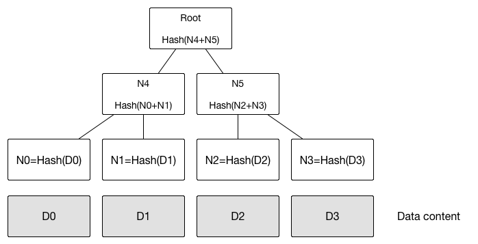

# Merkle 树

[默克尔树](https://en.wikipedia.org/wiki/Merkle_tree)（又叫哈希树）是一种二叉树，由一个根节点、一组中间节点和一组叶节点组成。最下面的叶节点包含存储数据或其哈希值，每个中间节点是它的两个孩子节点内容的哈希值，根节点也是由它的两个子节点内容的哈希值组成。

进一步的，默克尔树可以推广到多叉树的情形。

默克尔树的特点是，底层数据的任何变动，都会传递到其父亲节点，一直到树根。

默克尔树的典型应用场景包括：

* 快速比较大量数据：当两个默克尔树根相同时，则意味着所代表的数据必然相同。
* 快速定位修改：例如上例中，如果 D1 中数据被修改，会影响到 N1，N4 和 Root。因此，沿着 Root --> N4 --> N1，可以快速定位到发生改变的 D1；
* 零知识证明：例如如何证明某个数据（D0……D3）中包括给定内容 D0，很简单，构造一个默克尔树，公布 N0，N1，N4，Root，D0 拥有者可以很容易检测 D0 存在，但不知道其它内容。
